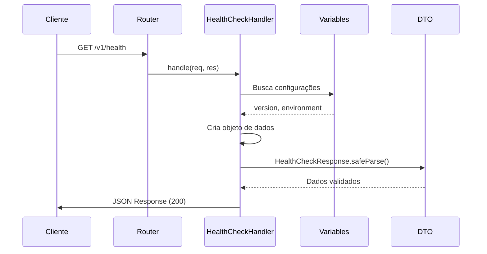
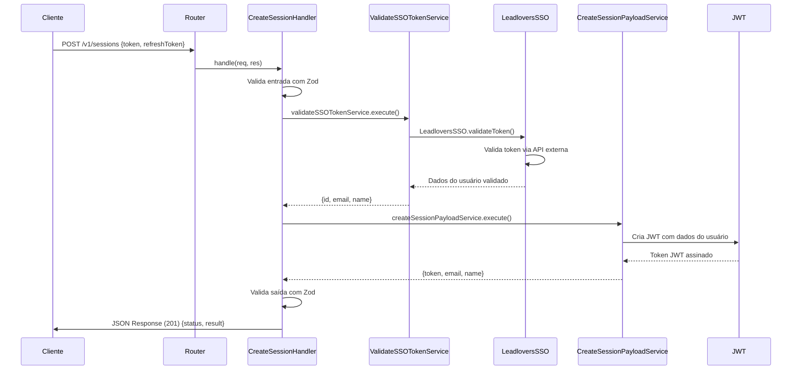
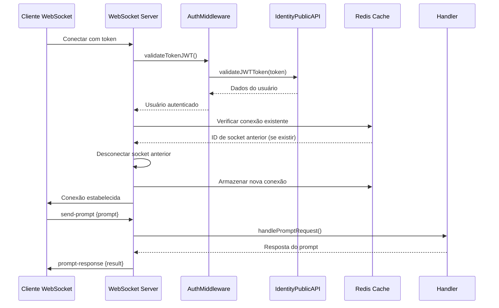

# Arquitetura do Projeto

## 📖 Visão Geral

O LeadLovers MCP Client foi projetado seguindo os princípios da **Clean Architecture**, promovendo separação clara de responsabilidades, testabilidade e manutenibilidade.

## 🏗️ Estrutura de Pastas

```
LeadLovers.Api.MCPClient/
├── src/                           # Código fonte
│   ├── infra/                    # Camada de Infraestrutura
│   │   ├── http/                 # Configuração HTTP
│   │   │   ├── routes/           # Definição de rotas
│   │   │   │   ├── index.ts      # Agregador de rotas
│   │   │   │   ├── monitor.ts    # Rotas de monitoramento
│   │   │   │   └── identity.ts   # Rotas de autenticação/identidade
│   │   │   └── server.ts         # Configuração do servidor Express
│   │   ├── logger/               # Sistema de logging
│   │   │   └── pinoLogger.ts     # Configuração do Pino
│   │   └── swagger/              # Documentação da API
│   │       └── config.ts         # Configuração do Swagger/OpenAPI
│   ├── modules/                  # Módulos de domínio
│   │   ├── monitor/              # Módulo de monitoramento
│   │   │   └── presentation/     # Camada de apresentação
│   │   │       ├── dtos/         # Data Transfer Objects
│   │   │       │   └── healthCheckResponse.ts
│   │   │       └── handlers/     # Manipuladores de requisição
│   │   │           └── healthCheckHandler.ts
│   │   └── identity/             # Módulo de identidade/autenticação
│   │       ├── application/      # Camada de aplicação
│   │       │   ├── createSessionPayloadService.ts
│   │       │   └── validateSSOTokenService.ts
│   │       ├── external/         # Integrações externas
│   │       │   └── sso/
│   │       │       └── leadloversSSO.ts
│   │       └── presentation/     # Camada de apresentação
│   │           ├── dtos/
│   │           │   └── createSessionDTO.ts
│   │           └── handlers/
│   │               └── createSessionHandler.ts
│   ├── shared/                   # Recursos compartilhados
│   │   ├── configs/              # Configurações da aplicação
│   │   │   └── variables/        # Variáveis de ambiente
│   │   │       ├── index.ts      # Agregador de configurações
│   │   │       ├── auth.ts       # Config de autenticação
│   │   │       ├── logger.ts     # Config do logger
│   │   │       └── server.ts     # Config do servidor
│   │   ├── integration/          # Contratos de integração
│   │   │   └── interfaces/
│   │   │       └── ssoProvider.ts
│   │   ├── providers/            # Provedores de serviços externos
│   │   │   └── LeadloversSSO/
│   │   │       ├── interfaces/
│   │   │       │   ├── leadloversSSOProvider.ts
│   │   │       │   ├── leadloversSSOSession.ts
│   │   │       │   └── leadloversSSOUser.ts
│   │   │       └── implementations/
│   │   │           └── leadloversSSOProvider.ts
│   │   └── utils/                # Utilitários
│   │       └── gracefulShutdown.ts
│   └── index.ts                  # Ponto de entrada da aplicação
├── docs/                         # Documentação
│   ├── ARCHITECTURE.md           # Este arquivo
│   └── swagger-setup.md          # Guia do Swagger
├── scripts/                      # Scripts utilitários
│   └── validate-branch-name.mjs  # Validação de nome de branch
├── dist/                         # Código compilado (gerado)
└── [arquivos de configuração]    # package.json, tsconfig.json, etc.
```

## 🎯 Princípios Arquiteturais

### 1. Clean Architecture
- **Separação de Camadas**: Cada camada tem responsabilidades bem definidas
- **Inversão de Dependência**: Módulos de alto nível não dependem de módulos de baixo nível
- **Testabilidade**: Facilita a criação de testes unitários e de integração

### 2. Modularidade
- **Módulos por Domínio**: Cada funcionalidade é organizada em módulos independentes
- **Coesão Alta**: Elementos relacionados ficam próximos
- **Acoplamento Baixo**: Módulos interagem através de interfaces bem definidas

### 3. Configurabilidade
- **Environment-based**: Comportamento adaptável por ambiente
- **Type-safe**: Configurações tipadas e validadas
- **Centralizadas**: Configurações em local único e acessível

## 📋 Detalhamento das Camadas

### Infraestrutura (`src/infra/`)

**Responsabilidade**: Gerenciar recursos externos e tecnologias específicas.

#### HTTP (`src/infra/http/`)
- **server.ts**: Configuração do Express, middlewares, CORS e inicialização
- **routes/**: Definição de endpoints e vinculação com handlers
  - Uso de anotações Swagger para documentação inline
  - Separação por contexto funcional

#### Logger (`src/infra/logger/`)
- **pinoLogger.ts**: Configuração do Pino com formatação estruturada
- Logs JSON em produção, pretty-print em desenvolvimento
- Levels configuráveis por ambiente

#### Swagger (`src/infra/swagger/`)
- **config.ts**: Especificação OpenAPI 3.0
- Schemas reutilizáveis para DTOs
- Configuração de múltiplos servidores (dev/prod)

### Módulos (`src/modules/`)

**Responsabilidade**: Implementar regras de negócio específicas de cada domínio.

#### Monitor (`src/modules/monitor/`)

**Estrutura em Camadas**:

```
monitor/
└── presentation/          # Camada de Apresentação
    ├── dtos/             # Data Transfer Objects
    │   └── healthCheckResponse.ts
    └── handlers/         # Manipuladores HTTP
        └── healthCheckHandler.ts
```

#### Identity (`src/modules/identity/`)

**Responsabilidade**: Gerenciar autenticação e autorização via SSO.

**Estrutura em Camadas**:

```
identity/
├── application/          # Camada de Aplicação
│   ├── createSessionPayloadService.ts  # Criação de payload JWT
│   └── validateSSOTokenService.ts      # Validação de tokens SSO
├── external/            # Integrações Externas
│   └── sso/
│       ├── interfaces/                # Interfaces SSO
│       └── implementations/           # Implementações SSO
├── integration/                        # Integração com APIs
│   └── identityPublicAPI.ts           # API pública de identidade
└── presentation/        # Camada de Apresentação
    ├── dtos/
    │   └── createSessionDTO.ts         # DTOs de sessão
    └── handlers/
        └── createSessionHandler.ts     # Handler de criação de sessão
```

**Futuras Expansões**:
```
monitor/
├── domain/               # Regras de negócio
│   ├── entities/        # Entidades de domínio
│   ├── services/        # Serviços de domínio
│   └── repositories/    # Contratos de repositório
├── application/          # Casos de uso
│   └── usecases/        # Implementação de casos de uso
├── infrastructure/       # Adaptadores externos
│   └── repositories/    # Implementações de repositório
└── presentation/         # Camada de apresentação
    ├── controllers/     # Controladores
    ├── dtos/           # DTOs
    └── handlers/       # Manipuladores
```

### Shared (`src/shared/`)

**Responsabilidade**: Recursos compartilhados entre módulos.

#### Configs (`src/shared/configs/`)
- **variables/**: Tipagem e validação de variáveis de ambiente
- Separação por contexto (server, logger, etc.)
- Valores padrão e transformações de tipo

#### Utils (`src/shared/utils/`)
- **gracefulShutdown.ts**: Implementação de shutdown graceful
- Utilitários reutilizáveis entre módulos
- Funções puras quando possível

## 🔄 Fluxo de Dados

### Requisição HTTP

```
Cliente HTTP → Express Router → Handler → DTO → Response
```

1. **Cliente**: Envia requisição HTTP
2. **Express Router**: Roteamento baseado em URL e método
3. **Handler**: Processamento da requisição
4. **DTO**: Validação e transformação de dados (Zod)
5. **Response**: Resposta estruturada ao cliente

### Health Check Flow



### Session Creation Flow (Identity Module)



### WebSocket Connection Flow



## 🛡️ Padrões de Segurança

### Validação de Dados
- **Zod**: Validação de schema em runtime
- **Type Safety**: Tipagem estática com TypeScript
- **DTO Pattern**: Objetos de transferência tipados

### CORS
- **Environment-based**: Configuração diferente por ambiente
- **Whitelist**: Apenas domínios autorizados em produção
- **Credential Support**: Suporte a cookies quando necessário

### Error Handling
- **Graceful Degradation**: Aplicação continua funcionando em caso de erro parcial
- **Structured Logging**: Logs estruturados para debugging
- **Error Boundaries**: Isolamento de erros por contexto

## 📊 Monitoramento e Observabilidade

### Logging
- **Structured Logs**: JSON em produção
- **Correlation IDs**: Rastreamento de requisições
- **Performance Metrics**: Tempo de resposta e uptime

### Health Checks
- **Application Health**: Status da aplicação
- **Dependencies**: Verificação de dependências externas (futuro)
- **Resource Usage**: Memória e CPU (futuro)

## 🔮 Evolutividade

### Extensões Planejadas

#### Novos Módulos
```
src/modules/
├── monitor/              # ✅ Implementado
├── identity/             # ✅ Implementado
│   ├── application/
│   ├── external/
│   └── presentation/
├── mcp/                  # 🔄 Em desenvolvimento
│   ├── application/
│   ├── domain/
│   ├── infrastructure/
│   └── presentation/
└── auth/                 # 📋 Planejado (expansão do identity)
    ├── application/
    ├── domain/
    ├── infrastructure/
    └── presentation/
```

#### Infraestrutura
```
src/infra/
├── http/                 # ✅ Implementado
├── logger/              # ✅ Implementado  
├── swagger/             # ✅ Implementado
├── database/            # 📋 Planejado
├── cache/               # 📋 Planejado
└── messaging/           # 📋 Planejado
```

### Padrões para Expansão

#### Novo Módulo
1. Criar estrutura de pastas seguindo o padrão
2. Implementar DTOs com validação Zod
3. Criar handlers com tipagem adequada
4. Adicionar rotas com documentação Swagger
5. Implementar testes unitários

#### Nova Rota
1. Definir DTO de request/response
2. Implementar handler na camada de apresentação
3. Registrar rota com anotação Swagger
4. Adicionar validação e error handling

## 🧪 Testabilidade

### Estrutura de Testes (Planejada)
```
tests/
├── unit/                # Testes unitários
│   ├── modules/
│   └── shared/
├── integration/         # Testes de integração
│   └── http/
└── e2e/                # Testes end-to-end
    └── api/
```

### Estratégias
- **Dependency Injection**: Facilita mocking
- **Pure Functions**: Funções testáveis independentemente
- **Interface Segregation**: Contratos pequenos e específicos

## 📝 Decisões Arquiteturais

### Por que Express?
- **Maturidade**: Framework consolidado e bem documentado
- **Ecosystem**: Grande quantidade de middlewares disponíveis
- **Performance**: Adequado para APIs REST
- **Simplicidade**: Curva de aprendizado baixa

### Por que Pino?
- **Performance**: Logger de alta performance
- **Structured Logging**: Logs estruturados nativamente
- **Ecosystem**: Integração com ferramentas de monitoramento

### Por que Zod?
- **Runtime Validation**: Validação em tempo de execução
- **Type Inference**: Inferência automática de tipos
- **Developer Experience**: API intuitiva e mensagens claras

### Por que Clean Architecture?
- **Maintainability**: Facilita manutenção e evolução
- **Testability**: Promove testes automatizados
- **Flexibility**: Permite mudanças de tecnologia sem impacto no core
- **Team Collaboration**: Estrutura clara para trabalho em equipe