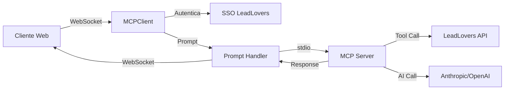

# WebSocket Server Documentation - LeadLovers MCP Client

> 🔌 Documentação completa do servidor WebSocket para comunicação em tempo real com integração MCP

## Overview

O servidor WebSocket fornece comunicação em tempo real entre clientes e o servidor MCP, com autenticação JWT, gerenciamento de sessões únicas por usuário, integração com Redis para persistência e processamento de comandos via MCP Server.

## Tecnologias Utilizadas

- **Socket.IO v4.8**: Framework WebSocket com fallback automático
- **Redis v4.7**: Cache e persistência de conexões
- **JWT**: Autenticação de clientes via LeadLovers SSO
- **TypeScript v5.9**: Type safety e melhor developer experience
- **MCP SDK**: Integração com Model Context Protocol

## Arquitetura

### Componentes Principais

#### 1. WebSocket Server (`src/infra/web-socket/server.ts`)
- Gerencia conexões Socket.IO
- Implementa política de conexão única por usuário
- Integra com Redis para persistência de sessões
- Processa eventos de clientes autenticados

#### 2. Auth Middleware (`src/infra/web-socket/middlewares/authMiddleware.ts`)
- Valida tokens JWT antes de estabelecer conexão
- Extrai informações do usuário do token
- Suporta múltiplas formas de envio do token (auth, headers, query)

#### 3. Redis Client (`src/shared/providers/Redis/redisClient.ts`)
- Singleton para gerenciamento de conexões Redis
- Reconexão automática com backoff strategy
- Operações básicas de cache (get, set, delete, exists)

## Funcionalidades

### Autenticação

O servidor aceita tokens JWT em três formatos:

1. **Socket auth** (preferencial):
```javascript
const socket = io('http://localhost:3001', {
  auth: {
    token: 'seu-jwt-token'
  }
});
```

2. **Headers Authorization**:
```javascript
const socket = io('http://localhost:3001', {
  extraHeaders: {
    Authorization: 'Bearer seu-jwt-token'
  }
});
```

3. **Query parameter**:
```javascript
const socket = io('http://localhost:3001', {
  query: {
    token: 'seu-jwt-token'
  }
});
```

### Conexão Única por Usuário

O servidor garante que cada usuário tenha apenas uma conexão ativa:

1. Nova conexão verifica se existe conexão anterior no Redis
2. Se existir, desconecta a conexão anterior
3. Armazena o ID da nova conexão no Redis
4. TTL de 1 hora para limpeza automática

### Eventos Disponíveis

#### Cliente → Servidor

##### `send-prompt`
Envia um prompt para processamento pelo MCP Server.

```javascript
socket.emit('send-prompt', {
  prompt: 'Criar um lead chamado João Silva com email joao@example.com'
});
```

**Parâmetros**:
- `prompt` (string, obrigatório): Comando em linguagem natural para o MCP processar

**Exemplos de prompts**:
- "Liste todas as máquinas disponíveis"
- "Crie um lead para Maria Santos"
- "Gere um email de boas-vindas para novos assinantes"
- "Busque leads da máquina 12345"

#### Servidor → Cliente

##### `prompt-response`
Resposta do MCP Server ao prompt enviado.

```javascript
socket.on('prompt-response', (response) => {
  console.log('Resposta do MCP:', response);
  // response contém o resultado da ferramenta MCP executada
});
```

**Formato da resposta**:
```typescript
interface PromptResponse {
  isSuccess: boolean;
  data?: any;
  message?: string;
  error?: string;
  tool?: string; // Ferramenta MCP utilizada
  metadata?: {
    executionTime: number;
    model?: string;
  };
}
```

##### `error`
Erros de processamento ou autenticação.

```javascript
socket.on('error', (error) => {
  console.error('Erro:', error.message);
});
```

## Configuração

### Variáveis de Ambiente

```env
# Porta do servidor HTTP/WebSocket (padrão: 4444)
PORT=4444

# URLs permitidas para CORS
DOMAIN_URL=http://localhost:3000,https://app.leadlovers.com

# Redis (opcional em desenvolvimento)
REDIS_URL=redis://localhost:6379
REDIS_PASSWORD=opcional

# JWT/SSO
SSO_API_URL=https://sso.leadlovers.com/
API_SECRET=sua_chave_secreta

# MCP Server (quando conectado)
MCP_SERVER_PATH=/caminho/para/LeadLovers.Api.MCPServer
```

### Docker Compose

O projeto inclui configuração Docker Compose para Redis:

```bash
# Iniciar Redis
docker-compose up -d redis

# Parar Redis
docker-compose down
```

## Desenvolvimento

### Estrutura de Pastas

```
src/infra/web-socket/
├── server.ts              # Classe principal do servidor
└── middlewares/
    └── authMiddleware.ts  # Middleware de autenticação

src/shared/providers/Redis/
└── redisClient.ts         # Cliente Redis singleton
```

### Exemplo de Uso

#### Cliente JavaScript/TypeScript

```javascript
import { io } from 'socket.io-client';

// Conectar ao servidor
const socket = io('http://localhost:4444', {
  auth: {
    token: localStorage.getItem('jwt-token')
  },
  transports: ['websocket', 'polling'], // Ordem de preferência
  reconnection: true,
  reconnectionAttempts: 5,
  reconnectionDelay: 1000
});

// Eventos de conexão
socket.on('connect', () => {
  console.log('Conectado!', socket.id);
});

socket.on('disconnect', (reason) => {
  console.log('Desconectado:', reason);
});

// Exemplos de uso com MCP

// Criar um lead
socket.emit('send-prompt', {
  prompt: 'Crie um lead chamado Carlos Silva, email carlos@empresa.com, telefone 11987654321, na máquina 12345'
});

// Buscar leads
socket.emit('send-prompt', {
  prompt: 'Liste os leads da máquina 12345'
});

// Gerar conteúdo de email
socket.emit('send-prompt', {
  prompt: 'Crie um email de Black Friday com 50% de desconto para curso de marketing'
});

// Receber resposta
socket.on('prompt-response', (response) => {
  if (response.isSuccess) {
    console.log('Sucesso:', response.data);
    console.log('Ferramenta MCP usada:', response.tool);
  } else {
    console.error('Erro:', response.error);
  }
});

// Tratar erros
socket.on('error', (error) => {
  console.error('Erro:', error);
});
```

#### HTML de Teste

Um arquivo `test-websocket-auth.html` está disponível para testar a conexão WebSocket:

```bash
# Abrir no navegador
open test-websocket-auth.html
```

## Monitoramento

### Logs

O servidor utiliza Pino logger para registrar:
- Conexões e desconexões de clientes
- Autenticações bem-sucedidas e falhas
- Erros de socket
- Eventos de prompt

### Redis

Monitorar conexões ativas:

```bash
# Conectar ao Redis CLI
docker exec -it leadlovers-redis redis-cli

# Listar todas as chaves de conexão
KEYS ws:user:connection:*

# Ver detalhes de uma conexão
GET ws:user:connection:<user-id>
```

## Segurança

### Práticas Implementadas

1. **Autenticação JWT obrigatória**: Todas as conexões devem fornecer token válido
2. **Validação de origem (CORS)**: Apenas domínios autorizados em produção
3. **Conexão única por usuário**: Previne múltiplas sessões simultâneas
4. **TTL em cache**: Limpeza automática de sessões expiradas
5. **Graceful shutdown**: Fechamento limpo de conexões

### Recomendações

1. Use HTTPS/WSS em produção
2. Implemente rate limiting para eventos
3. Monitore tentativas de autenticação falhas
4. Configure timeouts apropriados
5. Use tokens com expiração curta

## Troubleshooting

### Problemas Comuns

#### Conexão recusada
- Verificar se o servidor está rodando
- Confirmar porta correta (padrão: 3001)
- Validar CORS configuration

#### Autenticação falha
- Verificar validade do token JWT
- Confirmar JWT_SECRET correto
- Checar formato do token (Bearer prefix se necessário)

#### Redis connection error
- Verificar se Redis está rodando
- Confirmar REDIS_URL correto
- Checar credenciais se configuradas

#### Desconexões frequentes
- Verificar estabilidade da rede
- Aumentar timeouts do Socket.IO
- Implementar reconexão automática no cliente

## Performance

### Otimizações Implementadas

1. **Redis como cache**: Reduz consultas ao banco de dados
2. **Conexão única**: Limita uso de recursos por usuário
3. **Event handlers eficientes**: Processamento assíncrono
4. **Singleton pattern**: Reutilização de conexões

### Métricas Recomendadas

- Número de conexões ativas
- Tempo médio de resposta para eventos
- Taxa de reconexão
- Uso de memória do Redis
- Latência de rede

## Integração com MCP Server

### Fluxo de Processamento



### Ferramentas MCP Disponíveis via WebSocket

| Ferramenta | Descrição | Exemplo de Prompt |
|------------|-----------|-------------------|
| `get_leads` | Buscar leads | "Liste os leads da máquina X" |
| `create_lead` | Criar lead | "Crie um lead chamado..." |
| `update_lead` | Atualizar lead | "Atualize o score do lead X" |
| `delete_lead` | Remover lead | "Remova o lead X da máquina Y" |
| `get_machines` | Listar máquinas | "Mostre todas as máquinas" |
| `get_machine_details` | Detalhes de máquina | "Detalhes da máquina X" |
| `get_email_sequences` | Sequências de email | "Liste sequências da máquina X" |
| `create_email_content` | Gerar email com IA | "Crie um email de..." |

## Roadmap

### Implementado ✅
- Servidor WebSocket com Socket.IO
- Autenticação JWT via SSO
- Integração com Redis
- Conexão única por usuário
- Processamento de prompts via MCP
- Integração com 8 ferramentas MCP

### Em Desenvolvimento 🔄
- [ ] Streaming de respostas longas
- [ ] Histórico de comandos
- [ ] Sugestões inteligentes

### Planejado 📋
- [ ] Rooms para organizações
- [ ] Rate limiting por usuário
- [ ] Métricas e analytics em tempo real
- [ ] Clustering para alta disponibilidade
- [ ] Persistência de mensagens
- [ ] Voice commands via Web Audio API
- [ ] Notificações push