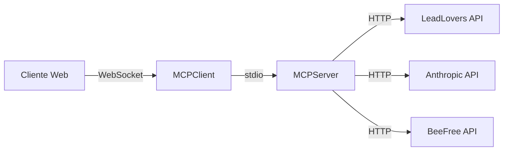

# LeadLovers MCP Server

> 🚀 Servidor MCP (Model Context Protocol) para integração inteligente entre LeadLovers CRM e IA

[](https://github.com/GustavoSantosLeadLovers/LeadLovers.Api.MCPClient)
[](https://nodejs.org/)
[](https://www.typescriptlang.org/)
[](https://modelcontextprotocol.io/)
[](https://opensource.org/licenses/ISC)

## 📋 Sobre o Projeto

O LeadLovers MCP Server é um servidor de ferramentas MCP que permite a integração inteligente entre o CRM LeadLovers e modelos de IA como Claude e GPT. Ele fornece um conjunto completo de ferramentas para automação de processos de CRM através de comandos em linguagem natural.

### ✨ Principais Características

- 🤖 **IA-First**: Processamento inteligente com Anthropic Claude
- 🛠️ **8 Ferramentas MCP**: Conjunto completo para gestão de CRM
- 📧 **Email Builder**: Geração de emails com IA + BeeFree
- ✅ **Validação Robusta**: Schemas Zod em todas as operações
- 🏗️ **Clean Architecture**: Separação clara de responsabilidades
- 🔒 **Segurança**: Validação e sanitização de dados

## 🛠️ Ferramentas MCP Disponíveis

### Gestão de Leads
- `get_leads` - Busca leads com filtros avançados e paginação
- `create_lead` - Cria novos leads com validação completa
- `update_lead` - Atualiza informações de leads existentes
- `delete_lead` - Remove leads de funis e sequências

### Gestão de Máquinas
- `get_machines` - Lista todas as máquinas/funis com paginação
- `get_machine_details` - Obtém detalhes completos de uma máquina

### Email Marketing
- `get_email_sequences` - Lista sequências de email de uma máquina
- `create_email_content` - Gera conteúdo de email com IA e BeeFree

## 🏗️ Arquitetura

```
LeadLovers.Api.MCPServer/
├── src/
│   ├── infra/                 # Infraestrutura MCP
│   │   └── mcp/              # Configuração do servidor
│   ├── server/               # Inicialização do servidor
│   ├── tools/                # Definições das ferramentas MCP
│   │   ├── leads.ts         # Ferramentas de leads
│   │   ├── machines.ts      # Ferramentas de máquinas
│   │   ├── email-sequence.ts # Ferramentas de sequências
│   │   └── emailMarketing.ts # Ferramenta de email com IA
│   ├── modules/              # Módulos de domínio (Clean Architecture)
│   │   ├── leads/
│   │   │   ├── application/ # Casos de uso
│   │   │   ├── domain/      # Entidades e regras
│   │   │   └── presentation/# Controllers/Handlers
│   │   ├── machines/
│   │   ├── emailSequences/
│   │   └── emailMarketing/
│   ├── shared/              # Recursos compartilhados
│   │   ├── configs/         # Configurações
│   │   ├── types/           # Tipos TypeScript
│   │   └── providers/       # Integrações externas
│   │       ├── LeadloversAPI/   # Cliente API LeadLovers
│   │       ├── AIAPI/            # Anthropic Claude
│   │       └── BuiderProvider/   # BeeFree Email Builder
│   └── utils/               # Utilitários
├── tests/                   # Testes (em desenvolvimento)
├── .env.example            # Template de variáveis
└── package.json            # Dependências e scripts
```

## 🚀 Instalação

### Pré-requisitos

- Node.js 18.x ou superior
- pnpm 10.15.1 ou superior
- Conta LeadLovers com API Token
- Chave API Anthropic Claude
- (Opcional) Conta BeeFree para email builder

### Setup Passo a Passo

1. **Clone o repositório**
```bash
git clone https://github.com/GustavoSantosLeadLovers/LeadLovers.Api.MCPClient.git
cd LeadLovers.Api.MCPClient/LeadLovers.Api.MCPServer
```

2. **Instale as dependências**
```bash
pnpm install
```

3. **Configure as variáveis de ambiente**
```bash
cp .env.example .env
```

Edite o arquivo `.env` com suas credenciais:

```env
# LeadLovers API
LEADLOVERS_API_URL=https://api.leadlovers.com
LEADLOVERS_API_TOKEN=seu_token_aqui

# Anthropic Claude
ANTHROPIC_API_KEY=sua_chave_anthropic
ANTHROPIC_MODEL=claude-3-haiku-20240307

# BeeFree Email Builder (opcional)
BEEFREE_API_URL=https://api.beefree.io
BEEFREE_API_TOKEN=seu_token_beefree

# OpenAI (opcional, para futuras integrações)
OPENAI_API_KEY=sua_chave_openai
```

4. **Execute em desenvolvimento**
```bash
pnpm dev
```

5. **Build para produção**
```bash
pnpm build
pnpm start
```

## 📝 Scripts Disponíveis

```bash
pnpm dev          # Desenvolvimento com hot reload
pnpm build        # Compila TypeScript para JavaScript
pnpm start        # Executa servidor em produção
pnpm test         # Executa testes
pnpm test:watch   # Testes em modo watch
pnpm coverage     # Relatório de cobertura
pnpm lint         # Verifica linting
pnpm lint:fix     # Corrige problemas de linting
pnpm type-check   # Verifica tipos TypeScript
```

## 💻 Uso com Claude Desktop

Para usar este servidor MCP com o Claude Desktop, adicione a seguinte configuração ao seu `claude_desktop_config.json`:

```json
{
  "mcpServers": {
    "leadlovers": {
      "command": "node",
      "args": ["C:/caminho/para/LeadLovers.Api.MCPServer/dist/index.js"],
      "env": {
        "LEADLOVERS_API_URL": "https://api.leadlovers.com",
        "LEADLOVERS_API_TOKEN": "seu_token",
        "ANTHROPIC_API_KEY": "sua_chave"
      }
    }
  }
}
```

## 🔌 Integração com MCPClient

Este servidor é projetado para trabalhar em conjunto com o LeadLovers.Api.MCPClient, que fornece:

- Interface REST API
- WebSocket para comunicação em tempo real
- Autenticação SSO
- Cache com Redis
- Interface web para testes

### Comunicação Client-Server



## 📚 Exemplos de Uso

### Criar um Lead

```javascript
{
  "tool": "create_lead",
  "arguments": {
    "Name": "João Silva",
    "Email": "joao.silva@example.com",
    "Phone": "+55 11 98765-4321",
    "MachineCode": 12345,
    "EmailSequenceCode": 1,
    "SequenceLevelCode": 1,
    "Tags": ["novo", "interesse-alto"]
  }
}
```

### Gerar Conteúdo de Email com IA

```javascript
{
  "tool": "create_email_content",
  "arguments": {
    "prompt": "Crie um email de boas-vindas para novos assinantes de um curso de marketing digital, destacando os benefícios do curso e próximos passos"
  }
}
```

### Buscar Leads com Filtros

```javascript
{
  "tool": "get_leads",
  "arguments": {
    "MachineCode": 12345,
    "EmailSequenceCode": 1,
    "Page": 1,
    "Items": 50
  }
}
```

## 🐛 Problemas Conhecidos

1. **LeadLoversAPIProvider**: Métodos `delete` e `put` estão usando verbo HTTP `GET` incorretamente
2. **Service Injection**: Em `tools/leads.ts`, todos os handlers estão usando `GetLeadsService`
3. **Naming**: Arquivo `createEmailContentService..ts` tem duplo ponto no nome

## 🧪 Testes

O projeto está configurado com Jest mas ainda não possui testes implementados. Para executar quando disponíveis:

```bash
pnpm test           # Testes unitários
pnpm test:watch     # Modo watch
pnpm coverage       # Relatório de cobertura
```

## 🔒 Segurança

- **Validação**: Todos os inputs são validados com Zod
- **Sanitização**: Respostas da IA são limpas e validadas
- **Timeout**: Limites configuráveis em todas as chamadas API
- **Rate Limiting**: Controle de requisições (em desenvolvimento)
- **Error Handling**: Padrão Result com tratamento consistente

## 📦 Dependências Principais

### Produção
- `@modelcontextprotocol/sdk` - SDK oficial do MCP
- `@anthropic-ai/sdk` - Integração com Claude
- `axios` - Cliente HTTP
- `zod` - Validação de schemas
- `dotenv` - Gerenciamento de variáveis de ambiente

### Desenvolvimento
- `typescript` - Linguagem principal
- `tsx` - Execução de TypeScript
- `jest` - Framework de testes
- `eslint` - Linting de código
- `prettier` - Formatação de código

## 🤝 Contribuindo

1. Fork o projeto
2. Crie sua feature branch (`git checkout -b feat/nova-funcionalidade`)
3. Commit suas mudanças (`git commit -m 'feat: adiciona nova funcionalidade'`)
4. Push para a branch (`git push origin feat/nova-funcionalidade`)
5. Abra um Pull Request

### Padrões de Código

- Use TypeScript com tipos explícitos
- Siga a arquitetura limpa estabelecida
- Adicione validação Zod para novos endpoints
- Documente novas ferramentas MCP
- Mantenha o padrão Result para respostas

## 🚀 Roadmap

- [ ] Implementar testes unitários e de integração
- [ ] Adicionar rate limiting robusto
- [ ] Implementar logs estruturados com Pino
- [ ] Criar ferramentas de scoring de leads com IA
- [ ] Adicionar suporte para OpenAI GPT-4
- [ ] Implementar cache para respostas da IA
- [ ] Criar dashboard de métricas
- [ ] Adicionar webhooks para eventos

## 📄 Licença

Este projeto está licenciado sob a licença ISC - veja o arquivo [LICENSE](../LICENSE) para detalhes.

## 👥 Equipe

- **Gustavo Santos** - Lead Developer - [GitHub](https://github.com/GustavoSantosLeadLovers)
- **LeadLovers Development Team**

## 🔗 Links Úteis

- [Model Context Protocol](https://modelcontextprotocol.io/)
- [Anthropic Claude](https://www.anthropic.com/)
- [LeadLovers CRM](https://leadlovers.com/)
- [BeeFree Email Builder](https://beefree.io/)

---

<div align="center">

**Desenvolvido com ❤️ pela equipe LeadLovers**

[⬆ Voltar ao topo](#leadlovers-mcp-server)

</div>