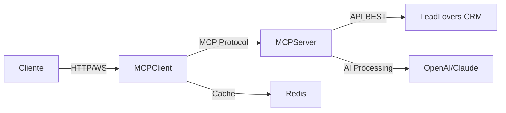

# LeadLovers MCP Integration Platform

<div align="center">

[](https://github.com/GustavoSantosLeadLovers/LeadLovers.Api.MCPClient/releases)
[](https://nodejs.org/)
[](https://www.typescriptlang.org/)
[](https://modelcontextprotocol.io/)
[](https://opensource.org/licenses/ISC)

**Plataforma de integração inteligente entre LeadLovers CRM e IA usando Model Context Protocol**

[Documentação](#-documentação) • [Instalação](#-instalação) • [Arquitetura](#-arquitetura) • [API](#-api-reference) • [Contribuir](#-contribuindo)

</div>

## 📋 Visão Geral

Este monorepo contém a solução completa para integração do LeadLovers CRM com capacidades de IA através do Model Context Protocol (MCP). A plataforma permite automação inteligente de processos de CRM usando comandos naturais e processamento avançado com IA.

### 🎨 Status do Projeto

[](https://github.com/GustavoSantosLeadLovers/LeadLovers.Api.MCPClient/releases)
[]()
[]()
[]()

### 🎯 Principais Funcionalidades

#### ✅ Implementadas
- **🤖 Integração com IA**: Anthropic Claude para geração de conteúdo
- **🔌 API REST/WebSocket**: Interface completa para comunicação em tempo real
- **🔐 Autenticação SSO**: Integração segura com LeadLovers SSO
- **📊 Gestão de Leads**: CRUD completo com validação Zod
- **📧 Email Marketing**: Geração de conteúdo com IA + BeeFree Builder
- **🏭 Gestão de Máquinas**: Listagem e detalhamento de funis
- **📬 Sequências de Email**: Gerenciamento de sequências automatizadas

#### 🔄 Em Desenvolvimento
- **🚀 Automação**: Processos inteligentes de scoring e segmentação
- **📈 Analytics**: Métricas e insights em tempo real
- **🧪 Testes**: Cobertura completa de testes unitários e integração

## 🏗️ Arquitetura

O projeto segue uma arquitetura de **monorepo** com dois componentes principais:

```
LeadLovers.Api.MCPClient/
├── 📁 LeadLovers.Api.MCPClient   # API Gateway & WebSocket Server
│   ├── src/
│   │   ├── infra/                # Infraestrutura (HTTP, WS, Logs)
│   │   ├── modules/              # Módulos de domínio
│   │   │   ├── identity/         # Autenticação SSO
│   │   │   ├── monitor/          # Health checks
│   │   │   ├── prompt/           # Processamento de prompts
│   │   │   └── websocket/        # Gerenciamento WebSocket
│   │   └── shared/               # Recursos compartilhados
│   └── dist/                     # Build de produção
│
└── 📁 LeadLovers.Api.MCPServer   # MCP Server & AI Tools (v2.2.1)
    ├── src/
    │   ├── infra/                # Infraestrutura MCP
    │   ├── server/               # Configuração do servidor MCP
    │   ├── tools/                # Ferramentas MCP
    │   │   ├── leads.ts          # Operações CRUD de leads
    │   │   ├── machines.ts       # Gestão de máquinas/funis
    │   │   ├── email-sequence.ts # Sequências de email
    │   │   └── emailMarketing.ts # Geração de conteúdo com IA
    │   ├── modules/              # Módulos de domínio (Clean Architecture)
    │   │   ├── leads/            # Domínio de leads
    │   │   ├── machines/         # Domínio de máquinas
    │   │   ├── emailSequences/   # Domínio de sequências
    │   │   └── emailMarketing/   # Domínio de email marketing
    │   ├── shared/               # Recursos compartilhados
    │   │   ├── configs/          # Configurações e variáveis
    │   │   ├── types/            # Definições TypeScript
    │   │   └── providers/        # Integrações externas
    │   │       ├── LeadloversAPI/    # Cliente API LeadLovers
    │   │       ├── AIAPI/            # Anthropic Claude
    │   │       └── BuiderProvider/   # BeeFree Email Builder
    │   └── utils/                # Utilitários e helpers
    └── dist/                     # Build de produção
```

### 🔄 Fluxo de Dados



## 🚀 Instalação

### Pré-requisitos

- Node.js 20.x ou superior
- npm 10.x ou pnpm 10.x
- Redis (para cache de sessões)
- Conta LeadLovers com API token

### Setup Rápido

1. **Clone o repositório**
```bash
git clone https://github.com/GustavoSantosLeadLovers/LeadLovers.Api.MCPClient.git
cd LeadLovers.Api.MCPClient
```

2. **Configure as variáveis de ambiente**

Para o **MCPClient**:
```bash
cd LeadLovers.Api.MCPClient
cp .env.example .env
# Edite .env com suas configurações
```

Para o **MCPServer**:
```bash
cd ../LeadLovers.Api.MCPServer
cp .env.example .env
# Configure tokens de API e credenciais
```

3. **Instale as dependências**

MCPClient:
```bash
cd LeadLovers.Api.MCPClient
npm install
```

MCPServer:
```bash
cd ../LeadLovers.Api.MCPServer
pnpm install  # Este projeto usa pnpm
```

4. **Execute em desenvolvimento**

Terminal 1 - MCPClient:
```bash
cd LeadLovers.Api.MCPClient
npm run dev
```

Terminal 2 - MCPServer:
```bash
cd LeadLovers.Api.MCPServer
pnpm dev
```

5. **Acesse a aplicação**
- API REST: http://localhost:4444/v1
- Documentação Swagger: http://localhost:4444/api-docs
- WebSocket: ws://localhost:4444

## 📖 Documentação

### MCPClient - API Gateway

- [Arquitetura](./LeadLovers.Api.MCPClient/docs/ARCHITECTURE.md)
- [WebSocket](./LeadLovers.Api.MCPClient/docs/WEBSOCKET.md)
- [Desenvolvimento](./LeadLovers.Api.MCPClient/docs/DEVELOPMENT.md)
- [Setup](./LeadLovers.Api.MCPClient/docs/SETUP.md)

### MCPServer - MCP Tools

- [Claude Guide](./LeadLovers.Api.MCPServer/CLAUDE.md)
- [Ferramentas MCP](./LeadLovers.Api.MCPServer/docs/TOOLS.md)

## 🛠️ Ferramentas MCP Disponíveis

### 📊 Gestão de Leads
| Ferramenta | Descrição | Status |
|------------|-----------|--------|
| `get_leads` | Busca leads com filtros e paginação | ✅ Implementado |
| `create_lead` | Cria novo lead com validação | ✅ Implementado |
| `update_lead` | Atualiza dados do lead | ✅ Implementado |
| `delete_lead` | Remove lead de funis/sequências | ✅ Implementado |

### 🏭 Gestão de Máquinas
| Ferramenta | Descrição | Status |
|------------|-----------|--------|
| `get_machines` | Lista todas as máquinas | ✅ Implementado |
| `get_machine_details` | Detalhes de uma máquina | ✅ Implementado |

### 📧 Email Marketing
| Ferramenta | Descrição | Status |
|------------|-----------|--------|
| `get_email_sequences` | Lista sequências de email | ✅ Implementado |
| `create_email_content` | Gera conteúdo com IA + BeeFree | ✅ Implementado |

## 🔌 API Reference

### REST Endpoints

#### Autenticação
```http
POST /v1/sessions
Content-Type: application/json

{
  "token": "sso_token",
  "refreshToken": "refresh_token"
}
```

#### Health Check
```http
GET /v1/health
```

### WebSocket Events

#### Conexão
```javascript
const socket = io('http://localhost:4444', {
  auth: {
    token: 'seu_jwt_token'
  }
});
```

#### Envio de Prompt
```javascript
socket.emit('send-prompt', {
  prompt: 'Crie um lead chamado João Silva'
});

socket.on('prompt-response', (response) => {
  console.log('Resposta:', response);
});
```

### MCP Tools

#### Criar Lead
```javascript
{
  "tool": "create_lead",
  "arguments": {
    "Name": "João Silva",
    "Email": "joao@example.com",
    "MachineCode": 12345,
    "EmailSequenceCode": 1,
    "SequenceLevelCode": 1
  }
}
```

#### Buscar Máquinas
```javascript
{
  "tool": "get_machines",
  "arguments": {
    "page": 1,
    "itemsPerPage": 20
  }
}
```

#### Criar Conteúdo de Email
```javascript
{
  "tool": "create_email_content",
  "arguments": {
    "prompt": "Crie um email de boas-vindas para novos assinantes de um curso de marketing digital, destacando os benefícios e próximos passos"
  }
}
```

## 🧪 Testes

### MCPClient
```bash
cd LeadLovers.Api.MCPClient
npm test          # Testes unitários
npm run test:e2e  # Testes end-to-end
```

### MCPServer
```bash
cd LeadLovers.Api.MCPServer
pnpm test         # Testes unitários
pnpm coverage     # Coverage report
```

## 📦 Build & Deploy

### Build de Produção

```bash
# MCPClient
cd LeadLovers.Api.MCPClient
npm run build

# MCPServer
cd ../LeadLovers.Api.MCPServer
pnpm build
```

### Docker

```bash
# Usando docker-compose
docker-compose up -d

# Build manual
docker build -t leadlovers-mcpclient ./LeadLovers.Api.MCPClient
docker build -t leadlovers-mcpserver ./LeadLovers.Api.MCPServer
```

### Variáveis de Ambiente

#### MCPClient (.env)
```env
# Server
NODE_ENV=production
PORT=4444

# Auth
SSO_API_URL=https://sso.leadlovers.com
API_SECRET=your_secret_key

# Redis
REDIS_URL=redis://localhost:6379

# CORS
DOMAIN_URL=https://app.leadlovers.com
```

#### MCPServer (.env)
```env
# LeadLovers API
LEADLOVERS_API_URL=https://app.leadlovers.com
LEADLOVERS_API_TOKEN=your_token

# AI Services
ANTHROPIC_API_KEY=your_claude_key
ANTHROPIC_MODEL=claude-3-haiku-20240307

# BeeFree Email Builder
BEEFREE_API_URL=https://api.beefree.io
BEEFREE_API_TOKEN=your_beefree_token

# OpenAI (opcional)
OPENAI_API_KEY=your_openai_key

# MCP
MCP_SERVER_NAME=leadlovers-mcp
MCP_SERVER_VERSION=2.2.1
```

## 🔄 CI/CD

O projeto utiliza GitHub Actions para automação:

- **Release Management**: Versionamento automático com Semantic Versioning
- **Conventional Commits**: Geração automática de CHANGELOG
- **Quality Gates**: Lint e build obrigatórios antes do release

### Workflow de Release

1. Faça commits seguindo [Conventional Commits](https://www.conventionalcommits.org/)
2. Abra PR para `main`
3. Após merge, o workflow cria release automaticamente

## 🤝 Contribuindo

1. Fork o projeto
2. Crie sua feature branch (`git checkout -b feat/amazing-feature`)
3. Commit usando conventional commits (`git commit -m 'feat: add amazing feature'`)
4. Push para a branch (`git push origin feat/amazing-feature`)
5. Abra um Pull Request

### Padrões de Código

- **TypeScript**: Use tipos explícitos
- **Clean Architecture**: Mantenha separação de camadas
- **Tests**: Escreva testes para novas funcionalidades
- **Docs**: Atualize documentação quando necessário

## 📊 Status do Projeto

### ✅ Implementado
- Infraestrutura base completa com TypeScript
- Autenticação SSO com LeadLovers
- WebSocket com Socket.io e Redis
- 8 ferramentas MCP funcionais
- Integração completa Client ↔ Server via stdio
- Processamento com IA (Anthropic Claude)
- Geração de email com BeeFree Builder
- Validação robusta com Zod
- Clean Architecture em todos os módulos

### 🔄 Em Desenvolvimento
- Testes unitários e de integração
- Documentação técnica completa
- Rate limiting avançado
- Logs estruturados com Pino

### 📋 Backlog
- Scoring inteligente de leads com IA
- Dashboard analytics em tempo real
- Integração com OpenAI GPT-4
- Automação de pipelines
- Webhooks e eventos

## 🛡️ Segurança

- **Autenticação**: JWT obrigatória com refresh tokens
- **Validação**: Schemas Zod em todas as entradas
- **Rate Limiting**: Controle de requisições por IP
- **CORS**: Política configurável por ambiente
- **Secrets**: Variáveis de ambiente isoladas
- **Sanitização**: Limpeza de respostas JSON da IA
- **Timeout**: Limites configuráveis em todas as APIs
- **Error Handling**: Tratamento padronizado com Result pattern

## 📄 Licença

Este projeto está licenciado sob a licença ISC - veja o arquivo [LICENSE](LICENSE) para detalhes.

## 👥 Equipe

- **Gustavo Santos** - Lead Developer - [GitHub](https://github.com/GustavoSantosLeadLovers)

## 🙏 Agradecimentos

- [LeadLovers](https://leadlovers.com) pela plataforma CRM
- [Anthropic](https://anthropic.com) pelo Model Context Protocol
- [OpenAI](https://openai.com) pela API de IA

---

<div align="center">

**[⬆ Voltar ao topo](#leadlovers-mcp-integration-platform)**

Feito com ❤️ pela equipe LeadLovers

</div>